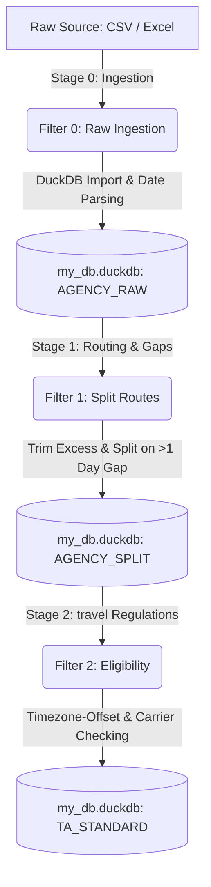

# Data Engineering Guidelines & Cheat Sheet
### Integrating DuckDB, Pandas, and NumPy in the Agency Pipeline

This document serves as the central handbook for Data Engineers working on the `AGENCY_V2` codebase. It outlines the architectural design, performance guidelines, optimization techniques, and core patterns used for high-performance processing of large-scale (5M+ rows) travel agency booking datasets (including Akbar, MiddleEast, MMT, Obilet, Riya, TBO, ThomasCook, and TrustTravel).

---

## 📌 Pipeline Architecture Overview

The processing pipeline is organized into a three-stage filter hierarchy designed to optimize data ingestion, clean itinerary structures, and evaluate passenger eligibility for compensations:



### Stage Summary
1. **Filter 0 (Ingestion)**: Reads raw Excel/CSV files, performs initial column normalization, parses dates using robust SQL date parsing (`STRPTIME`), and loads them into a localized `DuckDB` table.
2. **Filter 1 (Split Route)**: Processes multi-leg flights. Segments journeys, trims invalid inputs (e.g. flight count > date count), splits journeys into separate sub-journeys if consecutive dates differ by more than 1 day, and maps `ParentId` relationships.
3. **Filter 2 (Eligibility / EU-Eligible)**: Vectorizes complex aviation legal frameworks (EU261, UK carrier rules, Turkish Civil Aviation rules, Serbian rules) on the processed routes to tag journeys as `EUEligible` along with calculated timezone offsets.

---

## ⚡ DuckDB Integration Best Practices

DuckDB is our primary engine for analytical storage, querying, and out-of-core operations. It integrates seamlessly with Pandas DataFrames.

### 1. Connection Configurations & Guardrails
Always limit memory usage and threads to prevent DuckDB from freezing the host OS or crashing during concurrent steps:

```python
import duckdb
import os

def get_duckdb_connection(db_path: str, memory_limit: str = "8GB", threads: int = 8) -> duckdb.DuckDBPyConnection:
    con = duckdb.connect(db_path)
    con.execute(f"SET threads={threads}")
    con.execute(f"SET memory_limit='{memory_limit}'")
    con.execute("SET preserve_insertion_order=false")  # Improves append speeds
    con.execute(f"SET temp_directory='{os.path.join(os.path.dirname(db_path), 'temp')}'")
    return con
```

### 2. Native Ingestion vs. Pandas Register
When loading raw files, register your Pandas DataFrames directly with DuckDB to avoid slow insert-statement loop conversions:

```python
# Create target table structure in DuckDB
con.execute("""
    CREATE TABLE IF NOT EXISTS AGENCY_RAW (
        id UUID DEFAULT gen_random_uuid(),
        PaxName VARCHAR,
        BookingRef VARCHAR,
        DepartureDateLocal TIMESTAMP
    )
""")

# Register Pandas DataFrame as a temporary virtual table view
con.register("temp_df", df)

# Perform fast bulk insert
con.execute("""
    INSERT INTO AGENCY_RAW (PaxName, BookingRef, DepartureDateLocal)
    SELECT PaxName, BookingRef, STRPTIME(DepartureDateLocal, '%m/%d/%Y %H:%M')
    FROM temp_df
""")

# Clean up registration view
con.unregister("temp_df")
```

> [!NOTE]
> Utilizing `STRPTIME` inside DuckDB's engine is significantly faster than parsing dates row-by-row in Python, or loading dates as strings and executing `pd.to_datetime` afterwards.

---

## ⚙️ Memory & Speed: Out-of-Core Streaming Chunks

When working with multi-gigabyte databases, reading entire tables into memory will cause Out-Of-Memory (OOM) failures. We stream datasets in chunks and process them in parallel using Python's `ThreadPoolExecutor`.

```python
import concurrent.futures
from concurrent.futures import ThreadPoolExecutor

class ChunkedPipeline:
    def __init__(self, db_path, batch_size=200_000, workers=4):
        self.db_path = db_path
        self.batch_size = batch_size
        self.workers = workers
        
    def stream_chunks(self, con) -> Iterator[pd.DataFrame]:
        # Sort data to group connections/bookings together
        con.execute("SELECT * FROM OBILET_RAW ORDER BY BookingRef, DepartureDateLocal1")
        while True:
            chunk = con.fetch_df_chunk(self.batch_size)
            if chunk.empty:
                break
            yield chunk

    def process_chunk(self, df: pd.DataFrame) -> pd.DataFrame:
        # Perform heavy vectorized operations here
        # ...
        return df

    def run(self):
        read_con = duckdb.connect(self.db_path)
        write_con = duckdb.connect(self.db_path)
        
        max_queued = self.workers * 2
        futures = {}
        
        with ThreadPoolExecutor(max_workers=self.workers) as executor:
            for chunk_df in self.stream_chunks(read_con):
                # Submit chunk processing to workers
                future = executor.submit(self.process_chunk, chunk_df)
                futures[future] = len(chunk_df)
                
                # Prevent memory bloating: block if the work queue is saturated
                if len(futures) >= max_queued:
                    done, _ = concurrent.futures.wait(
                        futures.keys(), return_when=concurrent.futures.FIRST_COMPLETED
                    )
                    for f in done:
                        result_df = f.result()
                        self.bulk_insert(write_con, result_df)
                        del futures[f]
            
            # Drain remaining tasks
            for future in concurrent.futures.as_completed(futures):
                result_df = future.result()
                self.bulk_insert(write_con, result_df)
```

---

## 🐼 Pandas & NumPy Vectorization Cheat Sheet

Data engineers MUST avoid row-by-row iteration (`.iterrows()`, `.itertuples()`) and `.apply()` functions whenever possible. 

### 1. Vectorized String Cleanup & Conditional Filtering
Vectorized string functions operate in compiled C. Use them directly on Series:

```python
# Clean up flight numbers
df["FlightNumber_clean"] = df["FlightNumber"].astype(str).str.strip().str.upper()

# Exclude bad flight values with boolean masks
invalid_mask = df["FlightNumber_clean"].isin(["", "NAN", "NONE", "N/A"])
df = df.loc[~invalid_mask].copy()
```

### 2. Timezone Offset Lookup (Vectorized Mapping)
Avoid calling timezone offset calculations sequentially. Instead, group rows by timezone and execute offset functions per timezone group:

```python
def calc_gmt_offset(tz_name: str, date_val) -> float | None:
    if not tz_name or pd.isna(date_val):
        return None
    try:
        from zoneinfo import ZoneInfo
        from datetime import datetime, time
        # Standardize timestamp to midday to avoid DST transitions
        dt = datetime.combine(date_val.date(), time(12, 0)).replace(tzinfo=ZoneInfo(tz_name))
        return dt.utcoffset().total_seconds() / 3600
    except Exception:
        return None

def vectorized_gmt_offsets(airport_codes: pd.Series, dates: pd.Series, airport_tz_dict: dict) -> pd.Series:
    tz_names = airport_codes.map(airport_tz_dict)
    result = pd.Series([None] * len(airport_codes), index=airport_codes.index, dtype=object)
    
    # Loop ONLY through unique timezones (very few), not every row
    for tz_name in tz_names.dropna().unique():
        mask = tz_names == tz_name
        result.loc[mask] = [calc_gmt_offset(tz_name, d) for d in dates.loc[mask]]
        
    return result
```

### 3. Journey Agreggations with `groupby` and `transform`
To tag all segments of a flight connection (represented by a unique `_uid` or `ConnectionID`) with a journey-level property:

```python
# Fast extraction of the first departure airport and last arrival airport per journey
sorted_legs = df.sort_values("LegNo", kind="mergesort")
first_airports = sorted_legs.groupby("_uid", sort=False)["FromAirport"].first()
last_airports = sorted_legs.groupby("_uid", sort=False)["ToAirport"].last()

# Map the aggregated result back to all rows in the dataset
df["JourneyStartAirport"] = df["_uid"].map(first_airports)
df["JourneyEndAirport"] = df["_uid"].map(last_airports)

# Tag whether a flight connection is single-leg vs multi-leg
journey_leg_count = df.groupby("ConnectionID")["ConnectionID"].transform("size")
df["IsSingleFlight"] = (journey_leg_count == 1)
```

---

## ✈️ Flight Eligibility Logic Cheatsheet (EU261 / UK / TR / SRB)

The pipeline applies complex aviation regulations using vectorized logic. Here is the legal matrix and how it translates to code:

### 1. The Compensation Matrix

| Regulation | Carrier Code | Airport Criteria | Eligibility | Exceptions |
| :--- | :--- | :--- | :--- | :--- |
| **EU261** | EU Carrier | EU Departure **OR** EU Arrival | **Eligible** | Non-EU Carrier arriving in EU is NOT eligible unless special carrier code |
| **UK Regulation** | UK Carrier | Departure **OR** Arrival touches UK | **Eligible** | Applied journey-wide |
| **TR Regulation** | TR Carrier | Departure **OR** Arrival touches Turkey | **Eligible** | Domestic TR flights (Start & End both in TR) are strictly **Excluded** |
| **SRB Regulation** | SRB Carrier | Departure **OR** Arrival touches Serbia | **Eligible** | Applied journey-wide |

### 2. Implementation in Code

```python
# Helper subsets (Frozensets optimize hashing lookup speed)
SPECIAL_NON_EU_CARRIERS = frozenset({"BA", "TK", "PC", "JU", "FH", "VF", "VS", "XQ"})
TR_CARRIERS = frozenset({"TK", "PC", "FH", "XQ", "VF"})
UK_CARRIERS = frozenset({"BA", "VS"})
SRB_CARRIERS = frozenset({"JU"})
SRB_AIRPORTS = frozenset({"BEG", "INI", "KVO"})

def calculate_eligibility(df: pd.DataFrame, eu_airports, eu_carriers, tr_airports, uk_airports) -> pd.Series:
    # Segment groupings
    sorted_legs = df.sort_values("LegNo", kind="mergesort")
    first_airports = sorted_legs.groupby("_uid", sort=False)["FromAirport"].first()
    last_airports = sorted_legs.groupby("_uid", sort=False)["ToAirport"].last()
    
    # 1. Domestic Turkish Exclusions
    is_domestic_tr_journey = first_airports.isin(tr_airports) & last_airports.isin(tr_airports)
    is_domestic_tr = df["_uid"].map(is_domestic_tr_journey).fillna(False).astype(bool)
    
    # 2. UK Rules
    is_uk_carrier = df["AirlineCode"].isin(UK_CARRIERS)
    touches_uk = df["FromAirport"].isin(uk_airports) | df["ToAirport"].isin(uk_airports)
    uk_journey_eligible = (is_uk_carrier & touches_uk).groupby(df["_uid"], sort=False).any()
    
    # 3. Turkish Rules (excluding domestic)
    is_tr_carrier = df["AirlineCode"].isin(TR_CARRIERS)
    touches_tr = df["FromAirport"].isin(tr_airports) | df["ToAirport"].isin(tr_airports)
    tr_journey_eligible = (is_tr_carrier & touches_tr & ~is_domestic_tr).groupby(df["_uid"], sort=False).any()
    
    # 4. Serbian Rules
    is_srb_carrier = df["AirlineCode"].isin(SRB_CARRIERS)
    touches_srb = df["FromAirport"].isin(SRB_AIRPORTS) | df["ToAirport"].isin(SRB_AIRPORTS)
    srb_journey_eligible = (is_srb_carrier & touches_srb).groupby(df["_uid"], sort=False).any()
    
    # 5. EU261 Rules
    eu_dep = df["FromAirport"].isin(eu_airports)
    eu_arr = df["ToAirport"].isin(eu_airports)
    eu_carrier = df["AirlineCode"].isin(eu_carriers)
    is_special = df["AirlineCode"].isin(SPECIAL_NON_EU_CARRIERS)
    
    inbound_ok = (~eu_dep) & eu_arr & (eu_carrier | is_special)
    
    journey_agg = pd.DataFrame({
        "_uid": df["_uid"],
        "eu_dep": eu_dep,
        "eu_arr": eu_arr,
        "inbound_ok": inbound_ok
    }).groupby("_uid", sort=False).agg(
        first_eu_dep=("eu_dep", "first"),
        last_eu_arr=("eu_arr", "last"),
        any_inbound_ok=("inbound_ok", "any")
    )
    
    eu_journey_eligible = journey_agg["first_eu_dep"] | (
        ~journey_agg["first_eu_dep"] & journey_agg["last_eu_arr"] & journey_agg["any_inbound_ok"]
    )
    
    # Combine Rules
    all_eligible = (
        uk_journey_eligible | 
        tr_journey_eligible | 
        srb_journey_eligible | 
        eu_journey_eligible
    )
    
    # Map back to rows, overriding with False for domestic Turkish flights
    eligible_mapped = df["_uid"].map(all_eligible).fillna(False).astype(bool)
    return eligible_mapped & (~is_domestic_tr)
```

---

## 🚦 Itinerary Date-Gap Splitting Logic

Multi-leg booking rows contain consecutive legs (e.g. `FlightNumber1`, `FlightNumber2`, etc. up to 6 or 7). We check if a connection represents a continuous journey or multiple distinct trips:
- **Condition**: If there is a date gap of **more than 1 day** between the arrival/departure of consecutive legs, the booking must be split.
- **Child Row Relationships**: Reconstruct each segment as a separate row in the target table, keeping static information (`PaxName`, `BookingRef`, `Airline`) same, generating a new `id` (UUID), and tracking origin with `ParentId`.

```python
def day_gap(date1, date2):
    if pd.isna(date1) or pd.isna(date2):
        return None
    return abs((date2 - date1).days)

def find_split_indices(flights):
    """
    Given a list of flight legs: [(FlightNo_1, Date_1), (FlightNo_2, Date_2), ...]
    Returns indices where a split should occur (e.g. [2] means segment 1 ends at index 1,
    and segment 2 starts at index 2).
    """
    split_points = []
    for i in range(len(flights) - 1):
        gap = day_gap(flights[i][1], flights[i+1][1])
        if gap is not None and gap > 1:
            split_points.append(i + 1)
    return split_points
```

---

## 🕵️‍♂️ Gotchas & Checklist

> [!WARNING]
> Keep the following rules in mind to avoid common errors when modifying filters:

- [ ] **Avoid NaN Propagation**: DuckDB uses `NULL` but Pandas maps missing strings to `nan` or `NaN`. Always clean inputs with `.fillna("")` or `.replace("NAN", None)` before comparisons.
- [ ] **Correct Date Formats**: Excel files represent dates in varying formats (e.g. `MM/DD/YYYY HH:MM`, `YYYY-MM-DD`, DD-MM-YYYY). Verify raw formats before choosing `STRPTIME` codes.
- [ ] **Frozensets over Lists**: When searching values using `.isin()`, use Python `frozenset` objects for lookup values to ensure $O(1)$ lookup times.
- [ ] **Thread Safe SQLite/DuckDB Connections**: DuckDB connection instances are not thread-safe. Generate a dedicated connection instance for read operations inside chunk streams, and a separate connection for writing chunks.
- [ ] **Close Your DB File**: DuckDB locks its `.duckdb` storage file. Always wrap executions in `try...finally` statements and close your connections (`con.close()`).
- [ ] **Vectorized DST Handling**: Keep offsets dynamic using timezone names from reference database maps rather than hardcoded standard values (e.g. GMT+3) to ensure summer daylight savings offsets are calculated correctly.
